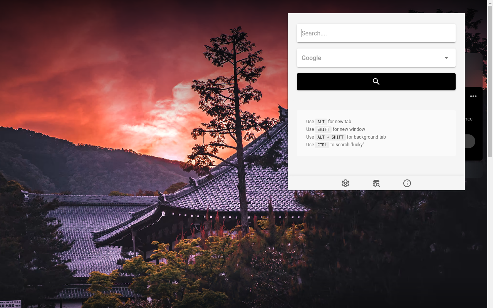

# G'day good folks!

The Aaiimm browser extension is pending review by Google. Meanwhile you can download and install it manually.

1. [Download](aaiimm-1.0.0.zip) and extract the ZIP file.
2. Drag and drop the `dist` folder into "Manage extensions".

---

